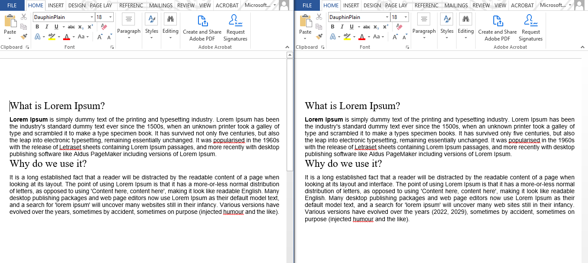
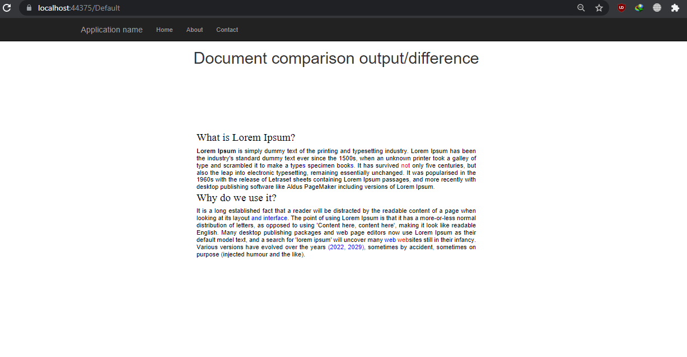

# Compare two documents in ASP.NET Web Forms
This web application elaborates how GroupDocs.Comparison for .NET [API](https://products.groupdocs.com/comparison/net) compares two documents. 

### How to Run
* Download or clone the project
* Restore NuGet package
* Build and run application

### Word Comparison
Both source and target files are stored in SampleFiles folder within the project. You can explicitly specify source and target files and compare them.   

Don't have the API subscription? You can request a [temporary license](https://purchase.groupdocs.com/buy) and run this demo application without any [trial limitations](https://docs.groupdocs.com/comparison/net/licensing-and-evaluation-limitations/). 

### Render Result In Browser
In order to view or render the comparison result in the browser, we used GroupDocs.Viewer for .NET [API](https://products.groupdocs.com/viewer/net). You can download and explore [this](https://github.com/groupdocs-free-consulting/display-document-in-browser-without-downloading) free consulting project on Document Viewer API. 

## Screenshots
* Source and Target Files  
 
* Displayed using ASP.NET Core application

# Interested in GroupDocs free consulting project?
[If you are also interested in a free consulting project by GroupDocs team then please view details on this page](https://github.com/groupdocs-free-consulting/)

If you have any questions about GroupDocs APIs, please feel free to post your query in [GroupDocs Forum](https://forum.groupdocs.com/).

Also, you can keep in touch with the latest developments in file format APIs offered by GroupDocs at our [Blog](https://blog.groupdocs.com/).

